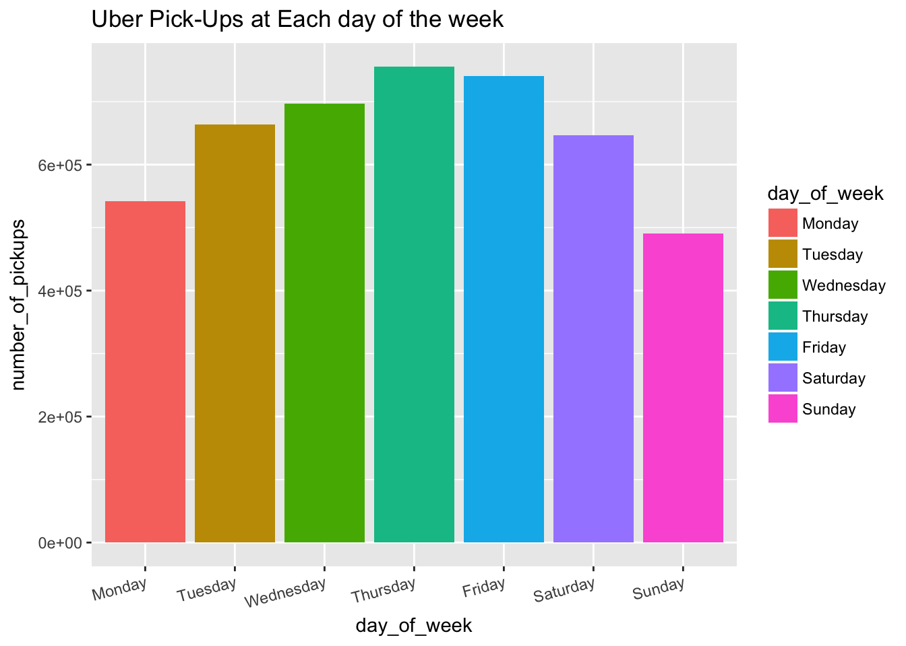
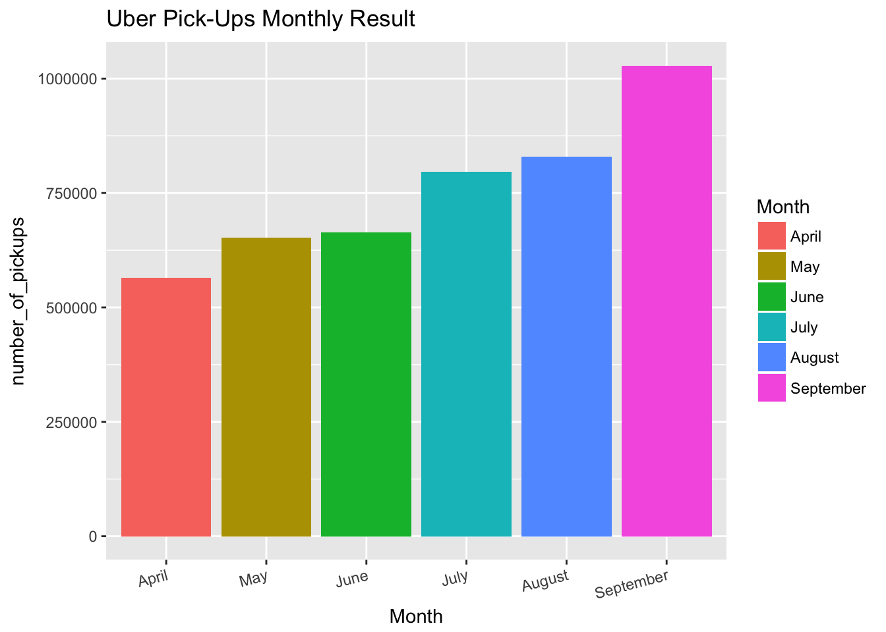
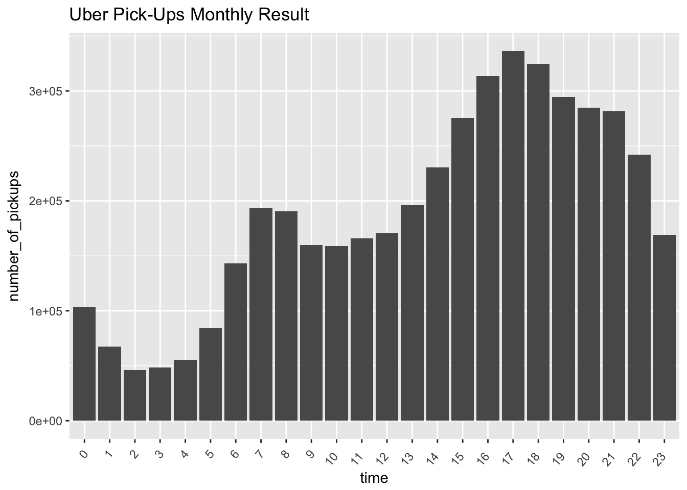
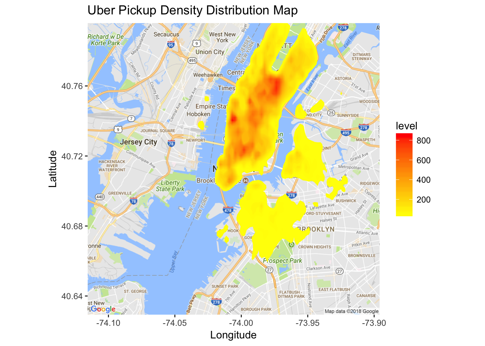
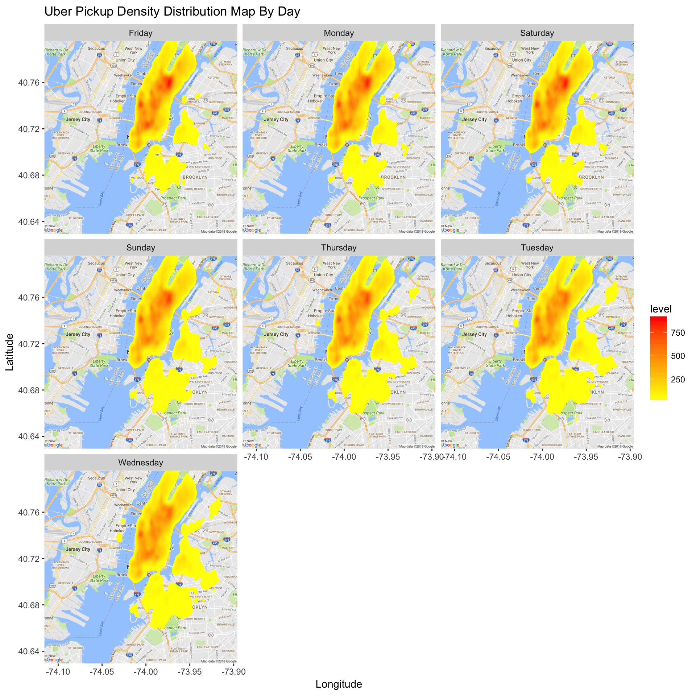
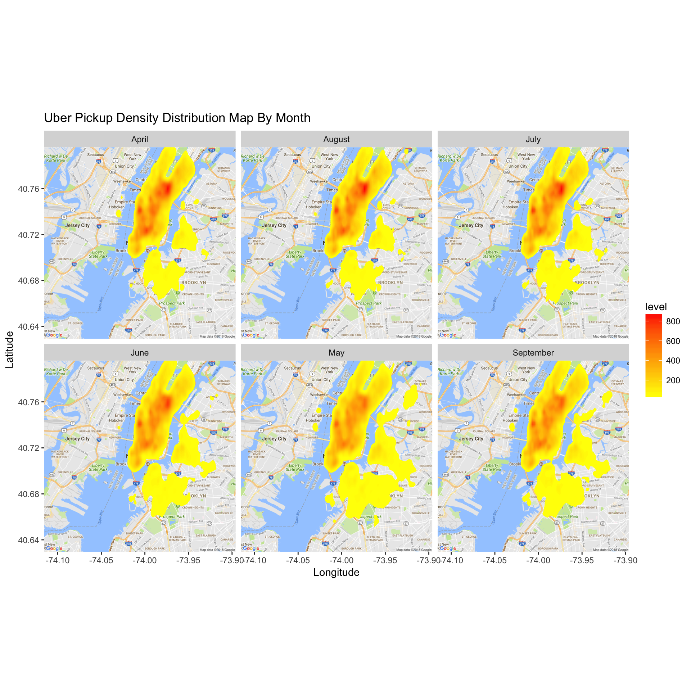

# Data_Visualisation

## Introduction

This project was done as a part of my coursework for Data Manipulation unit. The propose of this project is to investigate and visualise the Uber pickups data. The dataset contains over 4.5 million Uber pickups in New York City from April 2014 to September 2014. 

## Data
The files in the Dataset are separated by month and each has the following columns:  
* Date/Time: the data and time of the Uber pickup  
* Lat:The latitude of the Uber pickup  
* Lon:The longitude of the Uber pickup  
* Base:a code affiliated with the Uber pickup

## Task
1. Analysze and visualise the Uber Pick ups data according to the time, day and month.

2. Show how the number of pick-up vary per day of the week, per month per hour of the day according to location.

## Result

As can be seen From the chart below, the largest numebr of uber pickup is Thursday(755145) and the smallest the number of uber pickups is Sunday(490180).Also, the number of pickups is increasing from Monday to Thursday and is decreasing from Thursday to Sunday.

As can be seen from chart below, the number of uber pickup is increasing from April(564516) to September(1028136).

As can be seen from chart below, 17:00 (336190) has the highest number of pickup in the day and 2:00 in the midnight has smallest number of pickup in the day. these is a incresaing trends from 2:00 to 7:00 and then slight decrease from 7:00 to 10:00. After 10:0 in the morning, these is a increasing tends from 10:00 to 17:00. After that, a decresing trends strat from 17:00 to next day 2:00.

The charts shows the loaction of uber pickup and especially for density plot, the red ares shows more number of uber pickup.

Figures below shows number of pick up vary per day of the week and according to location. Red color areas shows more number of pick up than the yellow color areas.

Figures below shows number of pick uo vary per month and according to loaction. Red color areas shows more number of pick up than the yellow color areas.

Figures belowshows number of pick up vary per hour of the day and according to location.red color areas shows more number of pick up than the yellow color areas.

